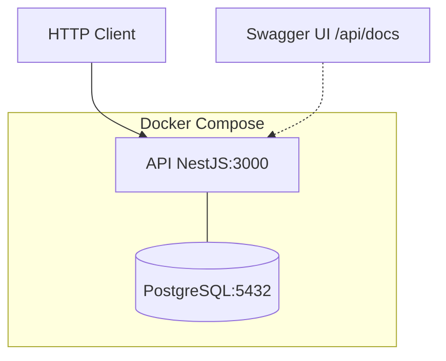

# E-commerce Backend — DDD + Arquitectura Hexagonal

Sistema de e-commerce tipo Amazon implementado como **monolito modular** con **Domain-Driven Design**, **Arquitectura Hexagonal (Puertos y Adaptadores)**, y patrones como **Saga Orquestada**, **Event Sourcing**, **Outbox Pattern**, **Pub/Sub** y **Correlation ID**.

## Stack

| Tecnología | Versión |
|---|---|
| Node.js | 22 (Alpine) |
| NestJS | 11 |
| TypeScript | 5.7 (strict: true) |
| TypeORM | 1.1 |
| PostgreSQL | 16 (Alpine) |
| Docker | Compose V2 |
| Swagger | @nestjs/swagger 11 |

## Bounded Contexts

| Contexto | Descripción | Patrón de Persistencia |
|---|---|---|
| **Catálogo** | Productos, categorías e inventario | State-oriented |
| **Carrito** | Carrito de compras temporal | State-oriented |
| **Promociones** | Cupones y descuentos | State-oriented |
| **Checkout** | Orquestación del flujo de compra | State-oriented + Outbox |
| **Pagos** | Procesamiento de pagos | **Event Sourcing** |
| **Envíos** | Gestión de envíos y tracking | State-oriented |
| **Devoluciones** | Gestión de devoluciones | **Event Sourcing** |

## Patrones Arquitectónicos

| Patrón | Ámbito |
|---|---|
| **Domain-Driven Design** | Todos los BCs |
| **Hexagonal (Puertos/Adaptadores)** | Todos los BCs |
| **Repository** | Todos los BCs |
| **Domain Events** | Todos los BCs |
| **Saga Orquestada** | Checkout |
| **Outbox Pattern** | Checkout |
| **Event Sourcing** | Pagos, Devoluciones |
| **Pub/Sub (EventEmitter2)** | Transversal |
| **Correlation ID** | Transversal |
| **Idempotency Key** | Checkout, Pagos |

## Inicio Rápido

```bash
# 1. Clonar el repositorio
git clone <repo-url>
cd backend

# 2. Copiar variables de entorno
cp .env.example .env

# 3. Iniciar con Docker
docker-compose up -d

# 4. Ejecutar migración de esquema (primera vez)
docker exec -i backend-db-1 psql -U postgres -d ecommerce_dev < schema.sql

# 5. (Opcional) Cargar datos de prueba
docker exec -i backend-db-1 psql -U postgres -d ecommerce_dev < seed.sql
```

La API estará disponible en `http://localhost:3000` y la documentación Swagger en `http://localhost:3000/api/docs`.

## Endpoints

| Método | Ruta | BC |
|---|---|---|
| POST | `/api/products` | Catálogo |
| GET | `/api/products` | Catálogo |
| GET | `/api/products/:id` | Catálogo |
| PUT | `/api/products/:id` | Catálogo |
| PATCH | `/api/products/:id/stock` | Catálogo |
| DELETE | `/api/products/:id` | Catálogo |
| POST | `/api/cart` | Carrito |
| GET | `/api/cart/:cartId` | Carrito |
| POST | `/api/cart/:cartId/items` | Carrito |
| PATCH | `/api/cart/:cartId/items/:productId` | Carrito |
| DELETE | `/api/cart/:cartId/items/:productId` | Carrito |
| DELETE | `/api/cart/:cartId` | Carrito |
| POST | `/api/promotions` | Promociones |
| GET | `/api/promotions` | Promociones |
| GET | `/api/promotions/:id` | Promociones |
| POST | `/api/promotions/validate` | Promociones |
| POST | `/api/promotions/apply` | Promociones |
| PATCH | `/api/promotions/:id` | Promociones |
| POST | `/api/checkout/orders` | Checkout |
| GET | `/api/checkout/orders/:id` | Checkout |
| POST | `/api/payments` | Pagos |
| GET | `/api/payments/:id` | Pagos |
| POST | `/api/payments/:id/authorize` | Pagos |
| POST | `/api/payments/:id/capture` | Pagos |
| POST | `/api/payments/:id/refund` | Pagos |
| POST | `/api/shipments` | Envíos |
| GET | `/api/shipments` | Envíos |
| GET | `/api/shipments/:id` | Envíos |
| PATCH | `/api/shipments/:id/status` | Envíos |
| POST | `/api/returns` | Devoluciones |
| GET | `/api/returns/:id` | Devoluciones |
| POST | `/api/returns/:id/approve` | Devoluciones |
| POST | `/api/returns/:id/reject` | Devoluciones |
| POST | `/api/returns/:id/receive` | Devoluciones |
| POST | `/api/returns/:id/refund` | Devoluciones |

**Health Check:** `GET /health`

## Estructura del Proyecto

```
src/
├── main.ts
├── app.module.ts
├── config/
├── database/
├── shared-kernel/
│   ├── domain/base/          # AggregateRoot, Entity, ValueObject, DomainEvent, Money
│   └── infrastructure/       # CorrelationIdMiddleware, HealthController
└── contexts/
    ├── catalogo/             # domain/ → application/ → infrastructure/
    ├── carrito/
    ├── promociones/
    ├── checkout/
    ├── pagos/
    ├── envios/
    └── devoluciones/
```

Cada BC sigue la misma estructura hexagonal:
- **domain/**: Entidades, Value Objects, Aggregates, Events, Domain Services
- **application/**: Use Cases, DTOs, Puertos (ports/in, ports/out)
- **infrastructure/**: Controllers, DTOs HTTP, TypeORM entities, Mappers, Repositories, Event Publishers

## Documentación Adicional

- [Domain Design](./docs/domain-design.md) — Bounded Contexts, Context Map, Eventos
- [ADR 0001](./docs/adr/0001-estructura-monolito-modular.md) — Monolito Modular
- [ADR 0002](./docs/adr/0002-fusion-catalogo-productos-inventario.md) — Fusión Catálogo
- [ADR 0003](./docs/adr/0003-event-sourcing-pagos-devoluciones.md) — Event Sourcing
- [ADR 0004](./docs/adr/0004-saga-orquestada-checkout.md) — Saga Orquestada
- [ADR 0005](./docs/adr/0005-pubsub-eventemitter2.md) — Pub/Sub Interno
- [ADR 0006](./docs/adr/0006-outbox-pattern-checkout.md) — Outbox Pattern
- [ADR 0007](./docs/adr/0007-correlation-id-transversal.md) — Correlation ID
- [ADR 0008](./docs/adr/0008-dtos-separados-por-capa.md) — DTOs por Capa
- [ADR 0009](./docs/adr/0009-entidades-typeorm-separadas.md) — TypeORM Separado
- [ADR 0010](./docs/adr/0010-shared-kernel-clases-base.md) — Shared Kernel
- [ADR 0011](./docs/adr/0011-money-value-object-compartido.md) — Money Compartido

## Comandos Útiles

```bash
# Desarrollo (local)
npm install
npm run start:dev

# Build
npm run build

# Tests
npm run test

# Lint
npm run lint

# Docker
docker-compose up -d           # Iniciar
docker-compose down            # Detener
docker-compose logs -f api     # Ver logs
```

## Diagrama de Arquitectura


